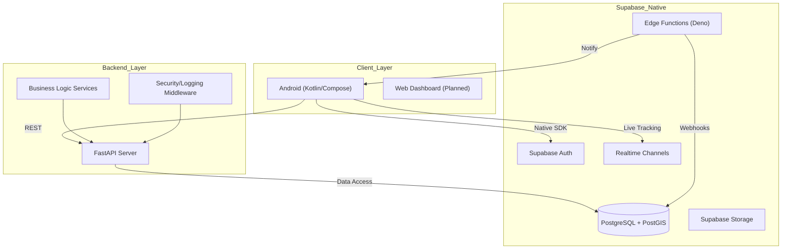

# Master Technical Architecture & Handoff Guide

## 1. System Architecture Diagram

## 2. Technical Stack
- **Backend**: FastAPI (Python 3.11), Pydantic v2, SlowAPI (Rate Limiting).
- **Database**: PostgreSQL with **PostGIS** extension for geographic calculations.
- **Frontend**: Android (Kotlin 2.1.0), Jetpack Compose, Room Database (Offline-First), Dagger Hilt (DI).
- **Real-time**: Supabase Realtime (Postgres Changes) and Deno Edge Functions.
- **DevOps**: Docker, Docker Compose, GitHub Actions (CI/CD).

## 3. Security Model
- **Authentication**: JWT-based via Supabase GoTrue.
- **Authorization**: Row Level Security (RLS) in PostgreSQL.
- **RBAC**: Custom roles (`CUSTOMER`, `DRIVER`, `ADMIN`, `BRANCH_MANAGER`).
- **Middleware**: Tightened CORS, HSTS, X-Frame-Options, and IP-based Rate Limiting on sensitive endpoints.

## 4. Performance Optimizations
- **Database**: Composite indexes for branch/status queries and materialized views for analytics.
- **API**: In-memory caching layer for product catalogs and branch metadata.
- **Mobile**: KSP-powered Room persistence for offline resilience.

## 5. Maintenance & Disaster Recovery
- **Backups**: PITR (Point-in-Time Recovery) should be enabled in the Supabase Dashboard.
- **Archiving**: The `archive_old_orders()` PL/pgSQL function moves old data every 6 months.
- **Alerting**: System health alerts are piped to Slack/Telegram webhooks.

## 6. Developer Onboarding
### Local Setup
1. **Backend**: `cd backend && pip install -r requirements.txt && uvicorn app.main:app --reload`
2. **Supabase**: `supabase start` (Requires CLI).
3. **Android**: Open project in Android Studio and run the `CleanDelivery` configuration.

---

> [!IMPORTANT]
> **Production Key Rotation**: Rotate the `SUPABASE_JWT_SECRET` and `ALERT_WEBHOOK_URL` every 90 days to maintain security compliance.
